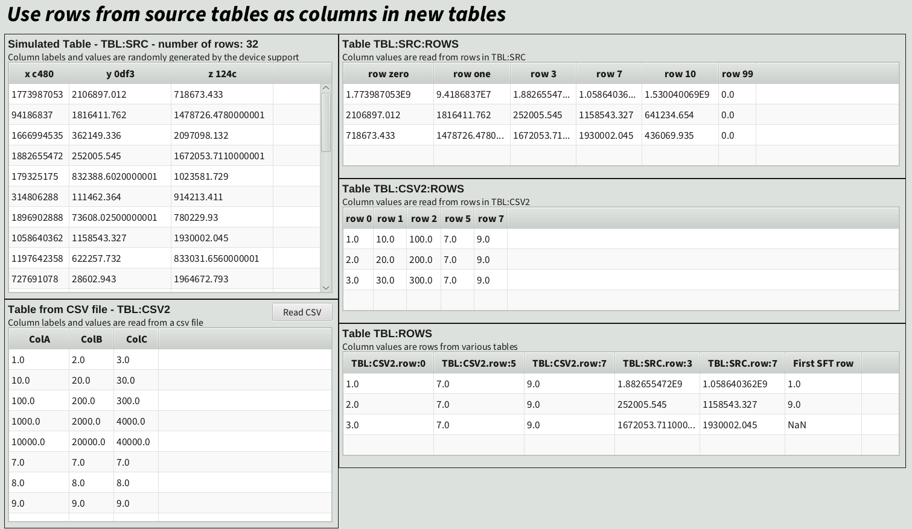

# This branch: testing-of-table-rows
This branch adds an example device support for reading rows
of a tableRecord. 

### 'Table Row' sample device support

The `Table Row` device support is provided as a simple example of how to
populate a table record from the rows of other table records. This device
reads tableRecords specified in the `CxxINP` fields and reads
the rows of the input table records.

The example (`table-rows.db`) reads selected rows from several sources:
```
record(table, "TBL:ROWS") {
    field(DTYP, "Table Row")
    field(DESC, "Selected rows from multiple tables")
    field(SCAN, "1 second")
    field(MAXROWS, "8")

    # Required fields for each column are:
    #  - CxxNAME - sets the name of the column, trailing decimal digits are
    #              used to select the row from the source table
    #  - CxxINP  - sets source table for the column, must be a table record name
    # Optional fields for each column are:
    # - CxxLABEL - defaults to <source name>.row:<row number>
    field(C00NAME, "tbl_csv2_row_0")  field(C00INP, "TBL:CSV2")
    field(C01NAME, "tbl_csv2_row_5")  field(C01INP, "TBL:CSV2")
    field(C02NAME, "tbl_csv2_row_7")  field(C02INP, "TBL:CSV2")
    field(C03NAME, "tbl_src_row_3")   field(C03INP, "TBL:SRC")
    field(C04NAME, "tbl_src_row_7")   field(C04INP, "TBL:SRC")
    field(C05NAME, "tbl_sft_row_0")   field(C05INP, "TBL:SFT")   field(C05LABEL, "First SFT row")

    field(PINI, "YES")
}
```

Example screenshot from phoebus, the *TBL:ROWS* from the above example is shown
in the lower right:


The device support code:
```bash
exampleApp/src/devTableRow.cpp
```

# Table Record

The table record is used to expose tabular data via PV Access, while integrating
reasonably well with other records. The data is stored in a set of named columns,
each an array of up to `MAXROWS` elements. A column can hold any of the supported
EPICS data types, plus a "variable string" type that allows for arrays of long
strings. Up to 64 data columns and 64 optional (per-column metadata) columns are
supported. The record is published over PV Access as an
[NTTable](https://github.com/epics-base/normativeTypesCPP).

## Building

This is a regular EPICS module. This project depends on
[EPICS Base](https://github.com/epics-base/epics-base) >= 7.0.4 and
[pvxs](https://github.com/epics-base/pvxs).

Once `EPICS_BASE` and `PVXS` are defined in `configure/RELEASE` (or any of the
referenced `RELEASE.local` files), you can build this project with a simple
`make` at the root.

### Running the tests

```sh
make runtests
```

### Running the example IOC

```sh
cd iocBoot/tableIOC
../../bin/linux-x86_64/tableExampleIoc st.cmd
```

## Documentation

Record documentation is available [here](https://osprey-dcs.github.io/tableRecord/tableRecord.html).

## tableRecord Examples

Under the `iocs` folder there is a `tableIOC` with a few examples of how to use
tableRecord. The startup script loads all four examples simultaneously.

### 1. 'Soft Channel' device support example

The built-in `Soft Channel` device support populates each column from its own
per-column `CxxINP` link - a constant, a database link, or a Channel Access
link. An example is provided in `table-soft.db`.

The example creates a three-column table (`TBL:SFT`) with:

- `x` (INT64) - fed from waveform record `TBL:SFT:COL00` (constant `[1, 2, 3]`)
- `y` (DOUBLE) - fed from waveform record `TBL:SFT:COL01` (constant `[9.0, 8.0]`)
- `z` (STRING) - fed from waveform record `TBL:SFT:COL02` with `CP`, so updates
  to that waveform automatically reprocess the table

An optional column (`units`) carries per-column metadata and is populated from a
constant link `["um", "um", "umstr"]`.

This example also illustrates how columns with different lengths are handled: `x`
has 3 rows and `y` has 2 rows, so `NROWS` differs per column.

### 2. 'CSV Loader' sample device support

The `CSV Loader` device support is provided as a simple example of how to
populate a table record from a CSV file. The file path is given in the record's
`INP` field using the instrument-link syntax:

```
field(INP, "@testfile.csv")
```

The CSV file must have a header row. On each processing cycle the file is
re-read, so writing to `PROC` acts as a reload. Each active data column's
`CxxNAME` value is matched against the CSV header to find the right column -
extra CSV columns are silently ignored. The CSV dialect supports quoted fields
(including fields with embedded commas and newlines) and both LF and CRLF line
endings.

### 3. 'Random Sim' sample device support

The `Random Sim` device support fills every active data column with `MAXROWS`
random values on each processing cycle, respecting each column's type. INT64 and
DOUBLE columns get uniformly distributed random numbers; STRING columns get
short random strings, with roughly every third row exceeding 39 bytes to exercise
the variable-string overflow path. Optional columns with constant `INP` links are
loaded once at initialization.

The example (`table-sim.db`) defines a three-column table (`TBL:SIM`) scanning
at 1 second, making it convenient for watching live NTTable updates in a PV
Access client.

### 4. 'Table Stat' sample device support

The `Table Stat` device support is provided as a simple example of how to
populate a table record based on the processing of input arrays. This device
reads arrays specified in the `CxxINP` fields and applies a statistical
compression function (one of `avg`, `rms`, `min`, `max`, `sum`) over fixed-size
buckets of N rows. The record is configured via its `INP` field:

```
field(INP, "@N=8 STATS=avg,rms,min,max,sum")
```

This configures the record to use buckets of size 8, applying one statistic per
output column in order: column 0 gets the **Average**, column 1 gets the **RMS**,
and so on. The number of output rows is `floor(inputRows / N)`, capped by
`MAXROWS`; trailing partial buckets are dropped. All output columns must be
`DOUBLE`.

The example (`table-stat.db`) pairs a source record (`TBL:SRC`, 32 rows of
random data from `Random Sim`) with a statistics record (`TBL:STAT`, MAXROWS=4),
compressing every 8 source rows into one output row across five statistic columns.

## Variable Strings

EPICS strings are normally limited to 40 bytes (`MAX_STRING_SIZE`), leaving at
most 39 usable characters. tableRecord introduces a *variable string* encoding
for `STRING`-typed columns that lifts this restriction: device support code can
store strings of arbitrary length (including strings with embedded NUL bytes),
and PV Access clients receive the full content.

### How it works

Each 40-byte cell in a `STRING` column is encoded in one of three formats:

| Cell type | Condition | Storage |
|-----------|-----------|---------|
| **Type 1** - very short string | length ≤ 31, no embedded NUL | bytes stored directly in the cell, NUL-terminated |
| **Type 2** - short string | 32 ≤ length ≤ 39, no embedded NUL | bytes stored directly in the cell, NUL-terminated |
| **Type 3** - long string | length > 39, or embedded NUL | up to 31 bytes of UTF-8-clean preview in the cell; a heap pointer in bytes 32-39 carries the full string |

Types 1 and 2 are fully compatible with ordinary EPICS strings. Type 3 cells are
invisible to Channel Access and dbAccess - those clients see only the 31-byte
preview - but the full string is delivered to PV Access clients over NTTable.

### Writing long strings

Type 3 cells can only be written by device support code, using the C API in
`tableVStr.h`:

```c
tablerec_vstr_write(colbuf, row, bytes, len);
```

or the C++ helper in `tableRecordUtil.h`:

```cpp
wrapper.write_string_column(col, std::vector<std::string>{ ... });
```

External writes via `caput`, `dbpf`, or PV Access puts are accepted but are
silently truncated to 39 characters by the underlying `DBF_STRING` type, so they
produce at most a Type 2 cell.

### Memory management

Overflow heap blocks are freed automatically whenever a cell is overwritten with
a new value or cleared. The record's `special()` handler also frees any overflow
pointers before an external put can overwrite a cell, preventing leaks during
normal IOC operation. All access to the column buffer must be done while holding
the record lock.
